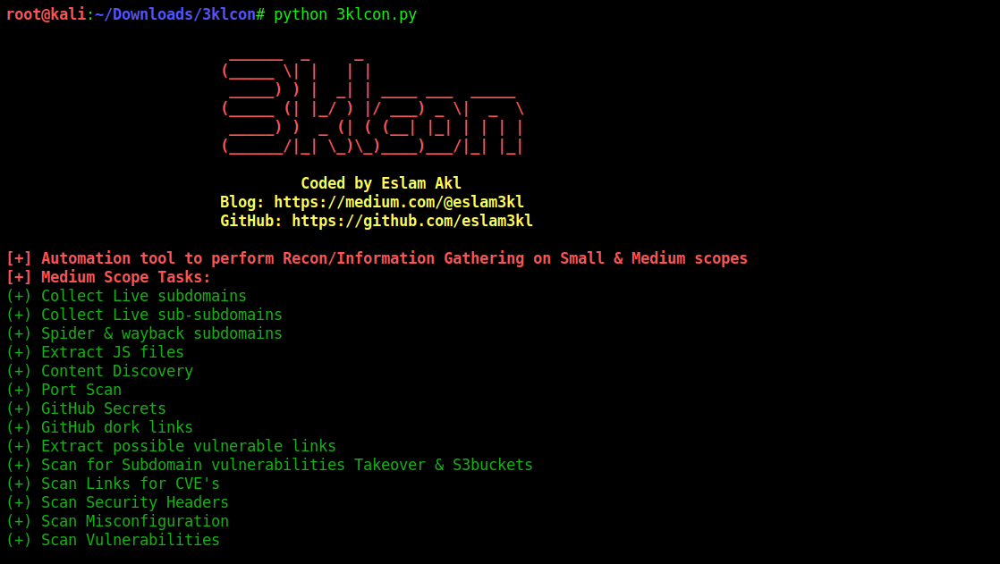

# 3klCon Project V1.0

## Description
Automation Recon tool which works with Small and Medium scopes. 
Recommended to use it on VPS machine, it'll take a long time on discovering secrets and searching for vulnerabilities 

----------------------------------------
## Installation

### 1. Install required tools
` chmod +x install_tools.sh `

` ./install_tools.sh ` 

### 2. Running tool

` python 3klcon.py -t target.com ` 

----------------------------------------
## Notes
[+] It will take almost 3 ~ 4 hours running so be _Patient_ 

[+] It will create a directory containing all results which related to your domain  

[+] Some of tools may need your reaction like entering your GitHub's 2FA or username, password, etc.

[+] Go to GitHound tool directory, enter you `github_username` and `github_password` info into `config.yml` 

----------------------------------------
## Tools useds
1. Subfinder
2. Assetfinder 
3. Altdns
4. Dirsearch
5. Httpx
6. Waybackurls
7. Gau
8. Git-hound
9. Gitdorks.sh
10. Naabu
11. Gf
12. Gf-templetes
13. Nuclei
14. Nuclei-templets
15. Subjack
16. Port_scan.sh
